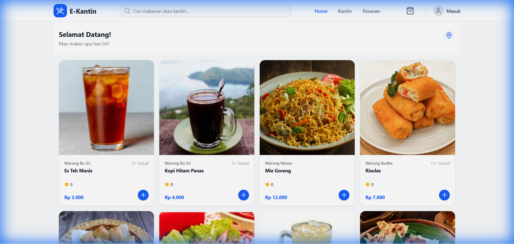
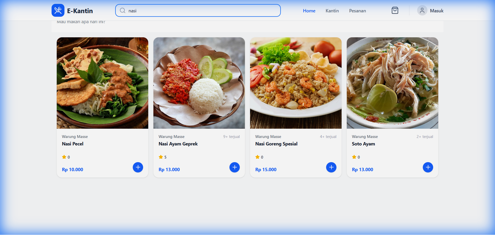
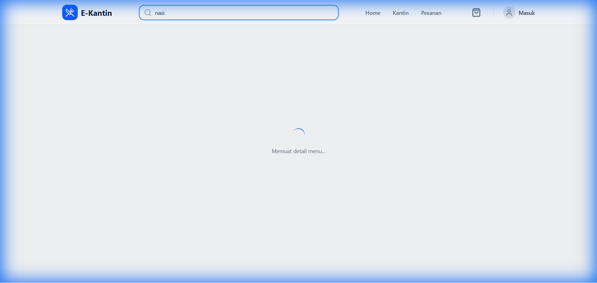
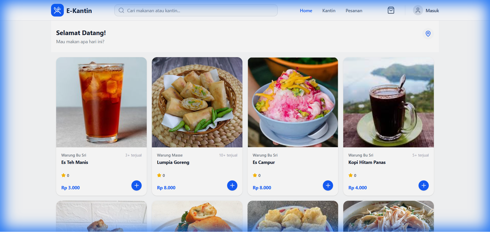
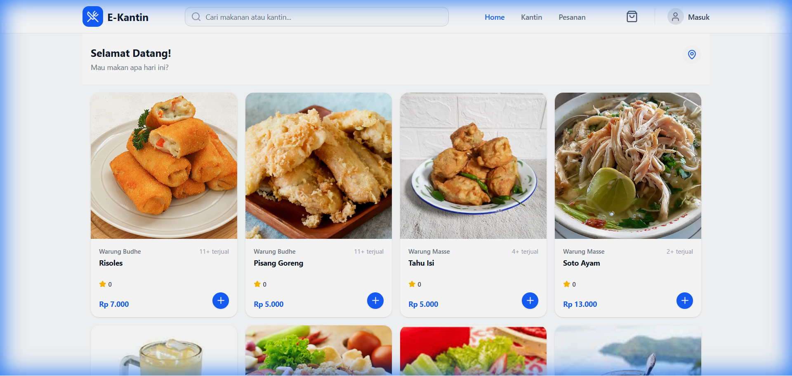

# 🍽️ E-Kantin - Sistem Pemesanan Makanan Digital

> Sistem Pemesanan Makanan Kantin Berbasis Website (Studi Kasus: Kantin Fakultas Teknik Unsoed)


## 📖 Deskripsi

E-Kantin adalah platform **marketplace kantin digital** yang memungkinkan mahasiswa, dosen, dan staff untuk memesan makanan dari berbagai stan kantin dalam satu aplikasi. Sistem ini menggunakan teknologi modern dengan arsitektur **Single Page Application (SPA)** untuk pengalaman pengguna yang cepat dan responsif.

## 🚀 Fitur Unggulan

### 1. **Multi-Tenant Marketplace**

- Mendukung banyak stan/kantin dalam satu platform
- Checkout multi-toko dalam satu transaksi
- Setiap pemilik stan memiliki panel manajemen sendiri

### 2. **Pembayaran Digital (Cashless)**

- Integrasi penuh dengan **Midtrans Snap API**
- Mendukung QRIS (GoPay, ShopeePay), Transfer Bank, E-Wallet
- Verifikasi pembayaran otomatis via Webhook
- Opsi pembayaran tunai tetap tersedia

### 3. **Keamanan & Kenyamanan**

- **Google OAuth Login** - Login mudah dengan akun Google
- **Auto-Cancel Orders** - Pembatalan otomatis pesanan yang belum dibayar
- Pengembalian stok otomatis saat pembatalan

### 4. **Efisiensi Operasional**

- Manajemen stok real-time
- Laporan penjualan terpusat
- Sistem paperless

---

## 📱 Fitur Per Halaman

### 🏠 Halaman Beranda (Home)



**Fitur:**

- Tampilan grid menu dari semua kantin
- Menu ditampilkan secara acak untuk keadilan exposure
- **Pencarian real-time** - cari menu atau nama kantin
- Menampilkan rating bintang dan jumlah terjual
- Tombol like untuk favorit menu
- Responsif untuk mobile dan desktop

---

### 🔍 Fitur Pencarian



**Fitur:**

- Filter menu berdasarkan nama menu
- Filter berdasarkan deskripsi menu
- Filter berdasarkan nama kantin/toko
- Hasil pencarian instan tanpa reload halaman

---

### 📋 Halaman Detail Menu



**Fitur:**

- Gambar menu full-width dengan gradient overlay
- Informasi kategori menu
- Harga dan status ketersediaan stok
- **Rating & Ulasan** - lihat rating rata-rata dan jumlah ulasan
- **Like/Favorit** - tombol untuk menyukai menu
- Informasi toko/kantin penjual
- Deskripsi lengkap menu
- **Quantity selector** - atur jumlah pesanan
- Tombol "Tambah ke Keranjang"
- **Section Ulasan** - lihat dan tulis ulasan

---

### 🛒 Halaman Keranjang (Cart)

**Fitur:**

- Item dikelompokkan berdasarkan toko/kantin
- Checkbox untuk memilih item yang akan di-checkout
- **Select All** - pilih semua item sekaligus
- Ubah jumlah item langsung dari keranjang
- Hapus item dari keranjang
- Total harga dinamis berdasarkan item terpilih
- Navigasi ke halaman checkout

---

### 💳 Halaman Checkout

**Fitur:**

- **Pilihan lokasi pengantaran:**
    - Gedung A-F
    - Sekre UKM
    - Gazebo 1-5
- Detail lokasi (opsional) - misal: "Lantai 2, Ruang 201"
- Catatan pesanan untuk penjual
- **Pilihan metode pembayaran:**
    - Pembayaran Online (Midtrans: QRIS, E-Wallet, Transfer Bank)
    - Bayar Tunai (COD)
- Ringkasan pesanan lengkap
- Tampilan biaya layanan (Gratis)
- Tombol "Pesan Sekarang"

---

### 💰 Halaman Pembayaran (Payment)

**Fitur:**

- Integrasi **Midtrans Snap** popup
- Pilihan metode pembayaran beragam:
    - QRIS (Scan QR)
    - GoPay, ShopeePay, OVO, dll.
    - Transfer Bank Virtual Account
- Status pembayaran real-time
- Redirect otomatis setelah pembayaran sukses

---

### 📜 Halaman Riwayat Pesanan (Order History)

**Fitur:**

- **Tab filter:**
    - Semua
    - Belum Bayar (PENDING)
    - Diproses (PROCESSING)
    - Selesai (COMPLETED/RECEIVED/CANCELLED)
- Kartu pesanan dengan:
    - Nama toko dan waktu order
    - Status pesanan dengan warna berbeda
    - Preview item pesanan
    - Total harga
- **Tombol aksi:**
    - "Bayar" - untuk pesanan pending
    - "Lacak" - untuk pesanan diproses
    - "Terima Pesanan" - konfirmasi penerimaan
    - "Detail" - lihat detail lengkap

---

### 📝 Halaman Detail Pesanan (Order Detail)

**Fitur:**

- Informasi lengkap pesanan
- Status pesanan dengan timeline
- **Countdown timer** untuk pesanan pending (auto-cancel dalam 1 jam)
- Daftar item pesanan
- Total pembayaran
- Catatan dan lokasi pengantaran

---

### 👤 Halaman Profil & Pengaturan

**Fitur:**

- Informasi akun pengguna
- Edit nama dan foto profil
- Pengaturan keamanan
- **Ganti password** dengan show/hide toggle
- Logout

---

### 📖 Halaman Panduan Pengguna (User Guide)

**Fitur:**

- Panduan langkah demi langkah cara menggunakan aplikasi
- Ilustrasi dan penjelasan fitur

---

### 🔑 Halaman Login



**Fitur:**

- Form login dengan email dan password
- **Google OAuth Login** - Login cepat dengan akun Google
- Link ke halaman registrasi
- Tampilan modern dan responsif

---

### 📝 Halaman Registrasi



**Fitur:**

- Form pendaftaran akun baru
- Input nama, email, dan password
- **Google OAuth Register** - Daftar cepat dengan akun Google
- Validasi form real-time
- Link ke halaman login

---

## 🔐 Panel Admin (Filament)

Panel admin menggunakan **Filament Admin Panel** untuk pengelolaan sistem:

### Dashboard

- Total order hari ini
- Total omzet
- Grafik status pesanan
- Statistik penjualan

### Manajemen Data

- **Customers** - Data pelanggan
- **Shops** - Data toko/stan kantin
- **Menu Categories** - Kategori menu
- **Menus** - Daftar menu makanan/minuman
- **Orders** - Pesanan masuk (konfirmasi status)
- **Transactions** - Riwayat transaksi
- **Expenses** - Pencatatan pengeluaran
- **Settlements** - Rekonsiliasi pembayaran
- **Users** - Manajemen admin/tenant

---

## 🛠️ Tech Stack

| Layer               | Teknologi                       |
| ------------------- | ------------------------------- |
| **Frontend**        | React + TypeScript + Inertia.js |
| **Styling**         | Tailwind CSS                    |
| **Backend**         | Laravel 11                      |
| **Admin Panel**     | Filament v3                     |
| **Database**        | MySQL                           |
| **Payment Gateway** | Midtrans Snap API               |
| **Authentication**  | Laravel Sanctum + Google OAuth  |

---

## ⚙️ Instalasi

### Prasyarat

- PHP >= 8.2
- Composer
- Node.js >= 18
- MySQL

### Langkah Instalasi

```bash
# 1. Clone repository
git clone https://github.com/Rifkyrahmat2006/e-kantin.git
cd e-kantin

# 2. Install dependencies
composer install
npm install

# 3. Setup environment
cp .env.example .env
php artisan key:generate

# 4. Konfigurasi database di .env
# DB_DATABASE=ekantin
# DB_USERNAME=root
# DB_PASSWORD=

# 5. Konfigurasi Midtrans di .env
# MIDTRANS_SERVER_KEY=your-server-key
# MIDTRANS_CLIENT_KEY=your-client-key
# MIDTRANS_IS_PRODUCTION=false

# 6. Jalankan migrasi & seeder
php artisan migrate --seed

# 7. Jalankan aplikasi
php artisan serve
npm run dev
```

---

## 📸 Demo Aplikasi

### Video Demo


Demo di atas menunjukkan alur penggunaan aplikasi:

1. Halaman beranda dengan daftar menu
2. Fitur pencarian menu
3. Halaman detail menu

---

## 👥 Tim Pengembang

Proyek ini dikembangkan untuk mata kuliah **Pemrograman Web** Semester 3 - Fakultas Teknik Universitas Jenderal Soedirman.

---

## 📄 Lisensi

Proyek ini dibuat untuk keperluan akademik.

---

<p align="center">
  <b>E-Kantin</b> - Solusi Digital untuk Kantin Modern 🍜
</p>
